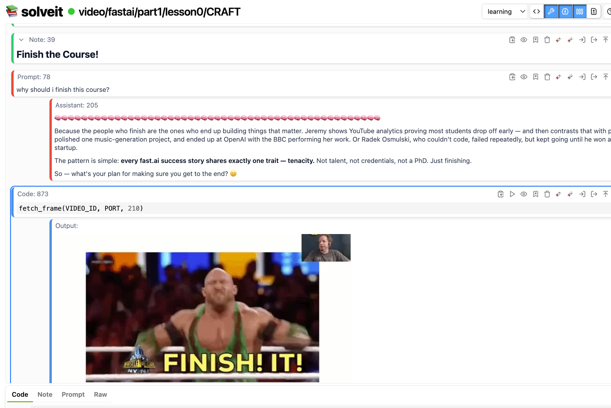

# fastai-close-reading



Structured close reading (or rather, close watching) transcripts of _almost_ every lesson in [Practical Deep Learning for Coders](https://course.fast.ai) by [Jeremy Howard](solve.it.com) — 28 lessons across Parts 1 & 2.

The [Data Ethics Bonus Lesson 8a](https://course.fast.ai/Lessons/lesson8a.html) is not included. Try add it yourself!

This repo is primarily designed for in-context study on [SolveIt](https://solve.it.com). However, it can still be used with other tools.

[中文 README →](README_zh.md)

---

## What Is This?

This repository contains transcripts structured as Jupyter Notebooks for _almost_ every lesson of fast.ai's *Practical Deep Learning for Coders*. Each lesson is broken down into segments with:

- **The narrative** of what Jeremy and gang says and shows
- **Video frame references** via `fetch_frame()` calls capturing slides, diagrams, and demonstrations
- **Surrounding context** — previous, current, and next lesson summaries in context (and loaded automatically if in SolveIt)
- **Challenges, homework, research directions, and resources** extracted and organized per lesson and per part

The goal is **reading out** of the course content, not into it. Thereby, allowing you to be a more critical learner, connect more deeply with the material itself, and remain in a flow state. Read more about close reading [here](https://www.fast.ai/posts/2026-01-21-reading-LLMs/).

## Repository Structure

```
.
├── CRAFT.ipynb                     # Course overview summary
├── CONTROLLER.ipynb                # Management dialog (lesson table)
├── part1/
│   ├── CRAFT.ipynb                 # Part 1 summary, challenges, resources
│   ├── lesson0/ → lesson8/
│   │   └── CRAFT.ipynb             # Per-lesson: summaries + close-reading notes
├── part2/
│   ├── CRAFT.ipynb                 # Part 2 summary, challenges, resources
│   ├── lesson9/ → lesson25/
│   │   └── CRAFT.ipynb             # Per-lesson: summaries + close-reading notes
└── summaries/
    ├── all.md                      # Combined course summary
    ├── part1.md / part2.md         # Part-level summaries
    └── lesson0.md ... lesson25.md  # Per-lesson standalone summaries
```

### What Are CRAFT Files?

On [SolveIt](https://solve.it.com), **CRAFT.ipynb** files provide per-folder LLM context. When you open a dialog inside a lesson folder, SolveIt automatically loads the CRAFT files from that folder and all parent folders, creating layered context:

| Level | Contains |
|-------|----------|
| **Root** | Full course overview |
| **Part** (`part1/`, `part2/`) | Part summary with challenges, homework, research directions, resources |
| **Lesson** (`part1/lesson3/`, etc.) | Previous + current + next lesson summaries, video ID, section-by-section close-reading notes with frame captures |

Open a dialog inside `part1/lesson3/` and you automatically get the course overview, Part 1 summary, and Lesson 3's full close-reading notes all before your first prompt.

### The `summaries/` Folder

Standalone markdown exports of each lesson's narrative summary. I have tailored the summaries to be more helpful for the LLM, than you as the reader.

## How to Use This

### On SolveIt (Recommended)

[SolveIt](https://solve.it.com) is where this repository is designed to live. The CRAFT layering gives you structured context automatically.

1. Clone this repo into your SolveIt instance
2. Navigate to a lesson folder (e.g., `part1/lesson3/`)
3a. Converse with the lesson's video
3b. or, create a new dialog for your own explorations – CRAFT context loads automatically

The LLM will have the full lesson breakdown, surrounding context, and resources available so you can ask questions, explore implications, identify patterns across lessons, and go as deep as you want into any segment.

**Tip: Exercise Notebooks.**  Try ask SolveIt to take the the official course exercise notebooks and replace the solution code with comments describing what you need to implement at each stage, as a way to have a guided from-scratch experience without answers.

**Tip: Study in Your Language.** You can translate the dialogs/notebooks into your own language and converse with the material in your native language for better understanding.

### Outside SolveIt

Even without SolveIt, the content is accessible:

- Upload `summaries/lesson3.md` before a lesson to prime yourself, or after a lesson to clarify concerns and doubts
- Open the CRAFT files (standard `.ipynb` notebooks) in editors (e.g., VS Code with the Copilot extension), so when you're programming, the LLM has full context

## Context Length Considerations

Each lesson's full CRAFT chain (root + part + lesson) consumes approximately:

| Stage | Tokens (est.) |
|-------|--------------|
| Start of dialog (summaries only, excluding transcript, no prompts) | ~20–30k |
| End of dialog (including summaries, transcript, no prompts) | ~50–70k |

If context becomes unwieldy during a long session:

- **Trim surrounding summaries:** Deep into Lesson 5? You probably don't need the full Lesson 5 summary. Ask the LLM to trim the lesson 5 summary relevant to where you are in the transcript.
- **Hide sections**: SolveIt supports collapsible headings and hiding sections. Hide sections from context you've already covered.
- **Start fresh dialogs** — for different segments of the same lesson, create separate dialogs. CRAFT context reloads cleanly each time.

## Video Frame Capture

The lesson CRAFT files contain `fetch_frame()` calls that capture screenshots from the lesson videos at specific timestamps. **All frames have already been captured and are stored in the notebooks** — you do not need to run these calls yourself.

However, if you want to capture frames at different timestamps, or re-run the frame captures yourself, you'll need to set up an SSH tunnel from SolveIt to your local machine. The `fetch_frame()` and `fetch_frames()` functions work by SSHing into your machine to run `yt-dlp` and `ffmpeg`.

### Prerequisites (on your local machine)

Install the required tools:

```bash
# macOS
brew install yt-dlp ffmpeg bore-cli tmux
```

### Setup

1. **Generate an SSH key on SolveIt** and add the public key to your local machine:

```bash
# On SolveIt
ssh-keygen -t ed25519
cat ~/.ssh/id_ed25519.pub

# On your local machine — paste the public key
echo "YOUR_PUBLIC_KEY_HERE" >> ~/.ssh/authorized_keys
```

2. **Start a bore tunnel** on your local machine to expose SSH:

```bash
tmux new -s bore
bore local 22 --to bore.pub
# Note the port number it returns (e.g., 14151)
```

3. **Update the port** in the lesson's `CRAFT.ipynb` — each lesson has a `PORT` variable at the top:

```python
VIDEO_ID = '8SF_h3xF3cE'
PORT = 14151  # ← your bore port
```

4. **Test the connection** from SolveIt:

```bash
ssh -o StrictHostKeyChecking=no YOUR_USERNAME@bore.pub -p YOUR_PORT "echo Connection successful!"
```

For a more detailed walkthrough, see [Tunneling from SolveIt to your Machine](https://forbo7.github.io/forblog/posts/33_tunneling_from_solveit_to_your_machine.html).

### Running Locally (without SolveIt)

If you're running the notebooks on your local machine, the SSH tunnel is unnecessary — `yt-dlp` and `ffmpeg` are already local. However, the `fetch_frame()` functions are written to execute commands over SSH. You have two options:

1. **Don't run them** — all frames are already captured and stored in the notebooks.
2. **Replace with local execution** — swap the `mac()` calls for direct `subprocess.run()` calls:

```python
import subprocess, base64
from PIL import Image
from io import BytesIO

def fetch_frame_local(id, timestamp, src='yt'):
    url_cmd = f'yt-dlp -f "best[height<=720]" -g "https://youtu.be/{id}" | head -1'
    url = subprocess.run(url_cmd, shell=True, capture_output=True, text=True).stdout.strip()
    cmd = f'ffmpeg -ss {timestamp} -i "{url}" -vframes 1 -f image2pipe -vcodec mjpeg - 2>/dev/null'
    result = subprocess.run(cmd, shell=True, capture_output=True)
    return Image.open(BytesIO(result.stdout))
```

## Known Issues & Exercises

Some imperfections in this repo. Great exercises if you'd like to contribute or practice.

### 1. KaTeX Rendering in Markdown Files

The `summaries/*.md` files use `$...$` for math instead of `\(...\)` and `\[...\]`. As such, math isn't rendered in SolveIt. Note, the transcripts themselves have math correctly rendered.

**Exercise:** Replace all math delimiters in the `.md` files to `\(...\)` (inline) and `\[...\]` (display).

### 2. Heading Granularity

Some note cells contain both a heading and body text. For better collapsing and folding in SolveIt and Jupyter environments, headings should live in their own note cells.

**Exercise:** Go through the CRAFT files and split any cell that has a heading followed by prose into separate cells. Heading in one, content below.

### 3. Missing Data Ethics Lesson

Only after completing this repo I realized I had omitted [Bonus Lesson 8a](https://course.fast.ai/Lessons/lesson8a.html) taught by [Rachel Thomas](https://rachel.fast.ai/about.html).

**Exercise:** Create a close-reading dialog/notebook for this lesson, its summary, and thus also update the Part 1 summary, entire course summary, and the lesson 8 and lesson 9 summaries.

### 4. Section Granularity

Some sections might cover multiple distinct topics. Finer-grained sections would make individual segments easier to jump around.

**Exercise:** Identify multi-topic sections and split them into focused, individually addressable segments.

## Links

- [SolveIt](https://solve.it.com)
- [fast.ai Course](https://course.fast.ai)
- [fastbook](https://github.com/fastai/fastbook) (available freely as Jupyter notebooks; try close reading this)
- [Part 1 Course Notebooks](https://github.com/fastai/course22)
- [Part 2 Course Notebooks](https://github.com/fastai/course22p2)
- [Part 2 Diffusion Notebooks](https://github.com/fastai/diffusion-nbs)
- [Data Ethics Bonus Lesson 8a](https://course.fast.ai/Lessons/lesson8a.html)
- [fast.ai Forums](https://forums.fast.ai)

## Acknowledgments

Built on Jeremy Howard and Rachel Thomas's [Practical Deep Learning for Coders](https://course.fast.ai). All dialogs/notebooks in this repo originate from their lesson videos and their lesson course pages. This repo repurposes their content for structured close reading and contextual organization for deeper study with LLMs.

---

*Crafted with [SolveIt](https://solve.it.com) by [Salman Naqvi](https://forbo7.github.io).*